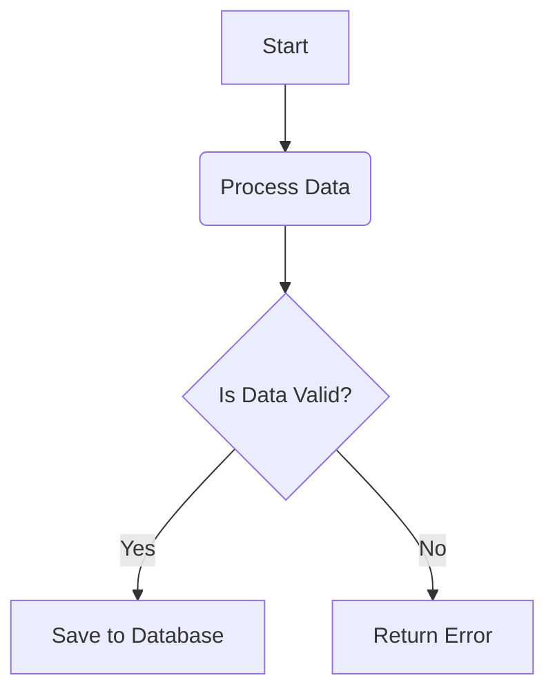

<p align="center">
  
</p>

<h1 align="center">FinanceAI</h1>

<p align="center">
  AI-powered financial analysis assistant.
</p>

## DEMO

## CONTENTS
1. About the Project
2. Features
3. Tech Stack
4. Project Structure
5. Architecture
6. How It Works
7. Installation
8. Configuration
9. Usage
10. Example Queries for Chatbot
11. Known Limitations
12. Author

## ABOUT THE PROJECT
This project began entirely for my own personal interests,
and as it progressed, I kept adding new features with growing enthusiasm until
it finally reached a point where I could present it here. 

Ever since I can remember, I’ve been a bit of a tightwad, 
and as I was thinking, ***“I wish my banking app had a tab that did some
kind of analysis so I could track my spending from there.”***, then it
suddenly occurred to me that I study computer engineering.

I really enjoyed working on this project. Since I started it to meet my own needs,
I believe I designed its features entirely from the user’s perspective,
and I still enjoy using it today.

## 🚀 FEATURES

- 📈 View the trend of your annual expenses in a single chart.
- 📊 See where you spend the most money based on the automatic categorizations created for you.
- 🎯 Compare your monthly expenses with those of the previous month and see how you're doing.
- 🖥️ Let the app track your spending at unfamiliar locations and predict it for you.
- 🤖 You can consult the Finance Assistant chatbot —customized with your data— on any topic, and request any kind of analysis.


## TECH STACK

| Category              | Technologies       |
|-----------------------|--------------------|
| 🐍 Language           | Python             |
| 🧠 AI                 | Google Gemini API  |
| 🤖 Machine Learning   | scikit-learn       |
| 🎨 UI                 | Streamlit          |
| 📊 Data Processing    | Pandas             |
| 📈 Data Visualization | Plotly             |
| 📦 Database           | SQLite, SQLAlchemy |
| 🔧 Version Control    | Git                |


## PROJECT STRUCTURE

```text
src/
├── finance_app.db                               
├── main.py                                      
├── application/                                 # Business logic and application services
│   ├── ai_services.py                             # AIService
│   ├── categorization_service.py                  # Categorizer
│   ├── financial_services.py                      # DashboardService, FinancialService
│   ├── ml_services.py                             # TransactionPredictor
│   └── transaction_service.py                     # TransactionService
│                                                
├── config/                                      # Application configuration
│   └── settings.py                              
│                                                
├── data/                                        # Source dataset
│   └── Transaction_History.xlsx                 
│                                                
├── domain/                                      # Entities and interfaces
│   ├── entities.py                                # Transaction
│   └── interfaces.py                              # TransactionRepository
│                                                
├── infrastructure/                              
│   ├── data/                                    # Data ingestion
│   │   ├── data_pipeline.py                       # DataCleaner
│   │   └── excel_parser.py                        # ExcelReader
│   ├── database/                                # SQLite & SQLAlchemy
│   │   ├── db_connection.py                       # DatabaseSession
│   │   ├── db_models.py                           # SQLAlchemyTransaction
│   │   ├── migration.py                           # DatabaseMigrator
│   │   └── repository.py                          # SQLiteTransactionRepository
│   ├── llm/                                     # Gemini client
│   │   └── client.py                            
│   ├── ml/                                      # ML classifier
│   │   └── text_classifier.py                   
│   └── nlp/                                     # Text vectorization
│       └── text_vectorizer.py                   
│                                                
└── presentation/                                
    ├── run_app.py                               
    ├── components/                              # Reusable Streamlit components
    │   ├── charts.py                              # FinancialVisualizer
    │   ├── chat_interface.py                      # ChatVisualizer
    │   ├── computer_image.png                   
    │   └── dashboard.py                           # DashboardFeatures
    └── views/                                   # Application pages
        ├── 1_🏠_Homepage.py                     
        ├── 2_💳_My_Transactions.py              
        ├── 3_📊_Chart_Analysis.py               
        └── 4_🤖_AI_Assistant.py                           
```

## ARCHITECTURE

### Clean Architecture



## HOW IT WORKS

## INSTALLATION

## CONFIGURATION

## USAGE

## USER INTERFACE

## EXAMPLE QUERIES FOR CHATBOT

## KNOWN LIMITATIONS

## AUTHOR

