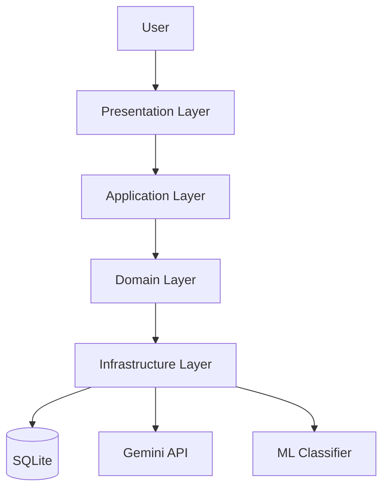
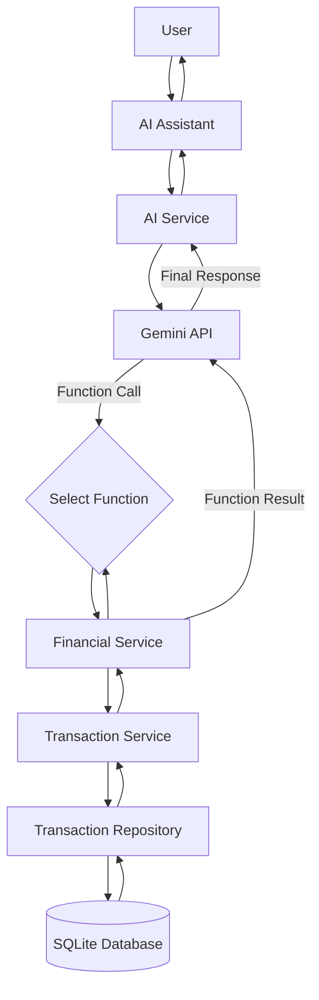

<p align="center">
  
</p>


<h1 align="center">
  FinanceAI
  <span style="font-size: 0.6em; font-weight: normal;">
     — AI-Powered Financial Analysis Platform
  </span>
</h1>

## DEMO


## CONTENTS

1. [About The Project](#about-the-project)
2. [Features](#features)
3. [Tech Stack](#tech-stack)
4. [Project Structure](#project-structure)
5. [Architecture](#architecture)
6. [How It Works](#how-it-works)
7. [Installation](#installation)
8. [Configuration](#configuration)
9. [Usage](#usage)
10. [Known Limitations](#known-limitations)
11. [Author](#author)

## ABOUT THE PROJECT
This project began entirely for my own personal interests,
and as it progressed, I kept adding new features with growing enthusiasm until
it finally reached a point where I could present it here. 

Ever since I can remember, I’ve been a bit of a tightwad, 
and as I was thinking, ***“I wish my banking app had a tab that did some
kind of analysis so I could track my spending from there.”***, then it
suddenly occurred to me that I study computer engineering.

I really enjoyed working on this project. Since I started it to meet my own needs,
I believe I designed its features entirely from the user’s perspective,
and I still enjoy using it today.

## FEATURES

- 📈 View the trend of your annual expenses in a single chart.
- 📊 See where you spend the most money based on the automatic categorizations created for you.
- 🎯 Compare your monthly expenses with those of the previous month and see how you're doing.
- 🖥️ Let the app track your spending at unfamiliar locations and predict it for you.
- 🤖 You can consult the Finance Assistant chatbot —customized with your data— on any topic, and request any kind of analysis.


## TECH STACK

| Category              | Technologies       |
|-----------------------|--------------------|
| 🐍 Language           | Python             |
| 🧠 AI                 | Google Gemini API  |
| 🤖 Machine Learning   | scikit-learn       |
| 🎨 UI                 | Streamlit          |
| 📊 Data Processing    | Pandas             |
| 📈 Data Visualization | Plotly             |
| 📦 Database           | SQLite, SQLAlchemy |
| 🔧 Version Control    | Git                |


## PROJECT STRUCTURE

```text
src/
├── finance_app.db                               
├── main.py                                      
├── application/                                 # Business logic and application services
│   ├── ai_services.py                             # AIService
│   ├── categorization_service.py                  # Categorizer
│   ├── financial_services.py                      # DashboardService, FinancialService
│   ├── ml_services.py                             # TransactionPredictor
│   └── transaction_service.py                     # TransactionService
│                                                
├── config/                                      # Application configuration
│   └── settings.py                              
│                                                
├── data/                                        # Source dataset
│   └── Transaction_History.xlsx                 
│                                                
├── domain/                                      # Entities and interfaces
│   ├── entities.py                                # Transaction
│   └── interfaces.py                              # TransactionRepository
│                                                
├── infrastructure/                              
│   ├── data/                                    # Data ingestion
│   │   ├── data_pipeline.py                       # DataCleaner
│   │   └── excel_parser.py                        # ExcelReader
│   ├── database/                                # SQLite & SQLAlchemy
│   │   ├── db_connection.py                       # DatabaseSession
│   │   ├── db_models.py                           # SQLAlchemyTransaction
│   │   ├── migration.py                           # DatabaseMigrator
│   │   └── repository.py                          # SQLiteTransactionRepository
│   ├── llm/                                     # Gemini client
│   │   └── client.py                            
│   ├── ml/                                      # ML classifier
│   │   └── text_classifier.py                   
│   └── nlp/                                     # Text vectorization
│       └── text_vectorizer.py                   
│                                                
└── presentation/                                
    ├── run_app.py                               
    ├── components/                              # Reusable Streamlit components
    │   ├── charts.py                              # FinancialVisualizer
    │   ├── chat_interface.py                      # ChatVisualizer
    │   ├── computer_image.png                   
    │   └── dashboard.py                           # DashboardFeatures
    └── views/                                   # Application pages
        ├── 1_🏠_Homepage.py                     
        ├── 2_💳_My_Transactions.py              
        ├── 3_📊_Chart_Analysis.py               
        └── 4_🤖_AI_Assistant.py                           
```

## ARCHITECTURE

### Clean Architecture



### AI Assistant Flow

This diagram illustrates the end-to-end workflow of the AI Assistant. When a user submits a question, the request is processed by the application layer, which retrieves the necessary financial data from the database according to the function call collected from Gemini API. When Gemini API creates the final response after making the call, the generated response is returned to the Streamlit interface and presented to the user.



## HOW IT WORKS

## QUICK INSTALLATION WITH DOCKER

You can use Docker to run the project on your local machine in an isolated
environment without dealing with any Python dependencies.

### Step 1: Clone the Project
```bash
git clone https://github.com/iremnaz-d/FinanceAI.git
```
```bash
cd FinanceAI
```

### Step 2: Build The Docker Image

Build the application's Docker image by running the following command in the project's 
root directory(where the Dockerfile is located). 
(This process may take 1-2 minutes depending on your computer's speed)
```bash
docker build -t finance_ai .
```

### Step 3: Run App

Use the following command to start the application.

Important Note: When the application runs, the database will be automatically created
under the `src` folder. The `-v` (volume) parameter in the command below ensures that
the database inside Docker is synchronized with your local machine. 
This way, your data will not be lost even if you stop Docker.

#### For Mac/Linux/Git Bash
```bash
docker run -p 8501:8501 -v "$(pwd)/src:/app/src" finance_ai
```

#### For Windows PowerShell
```PowerShell
docker run -p 8501:8501 -v "${PWD}/src:/app/src" finance_ai
```

#### For Windows CMD
```DOS
docker run -p 8501:8501 -v "%cd%/src:/app/src" finance_ai
```

### Step 4: Access to UI

Once the container is running successfully, 
open your web browser and go to the following address:
```text
http://localhost:8501
```


## CONFIGURATION

## USAGE

## USER INTERFACE

## EXAMPLE QUERIES FOR CHATBOT

## KNOWN LIMITATIONS
excel dosyasında yazı olmayan yerleri temizlemek gerekiyo
excel boş olunca dosya yüklemeye yönlendirmesi lazım
bana da göüzüküyo api key isteği?????????? almasa da çalışıyo ama
dockerdan kullanana her ai asistana girip çıktığında bi daha api key istiyo ama sohbet geçmişi duruyo

## FUTURE IMPROVEMENTS
login 
search bar for my transactions descriptions

## AUTHOR

