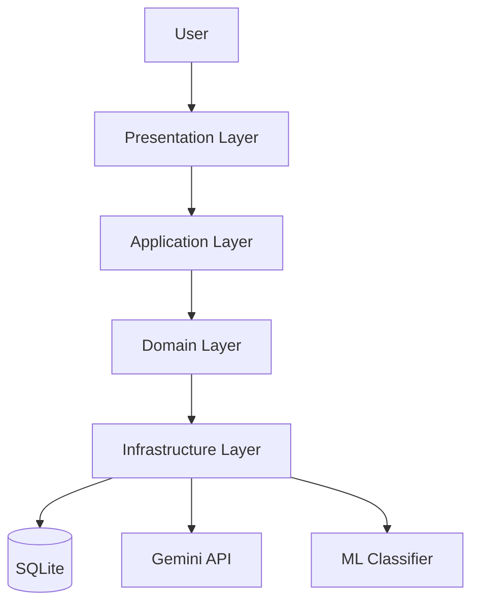
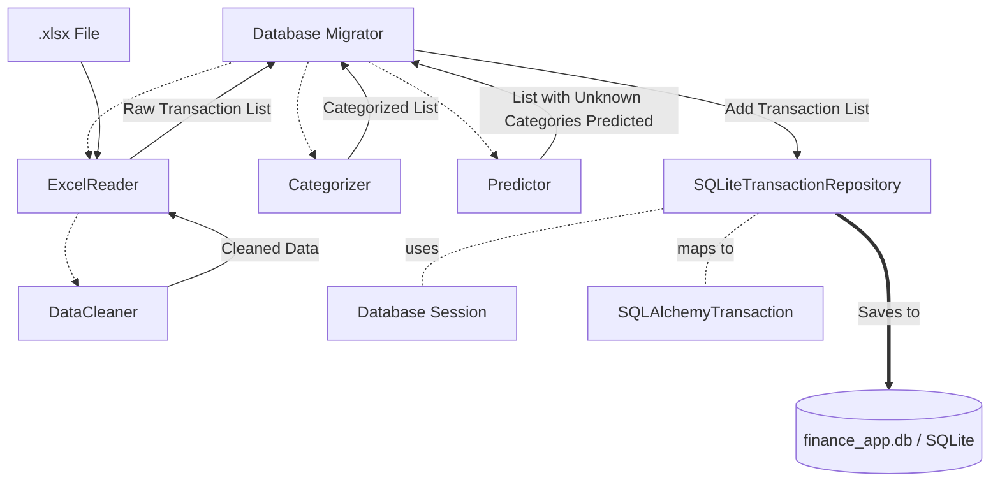
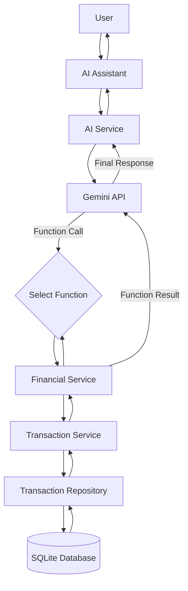
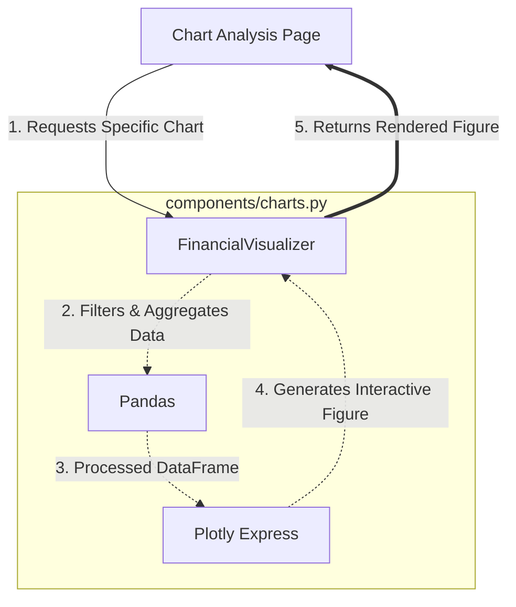
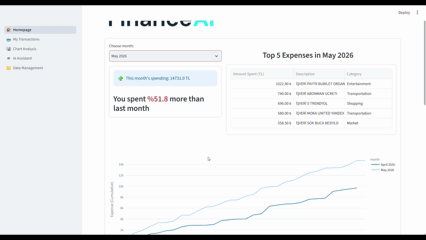
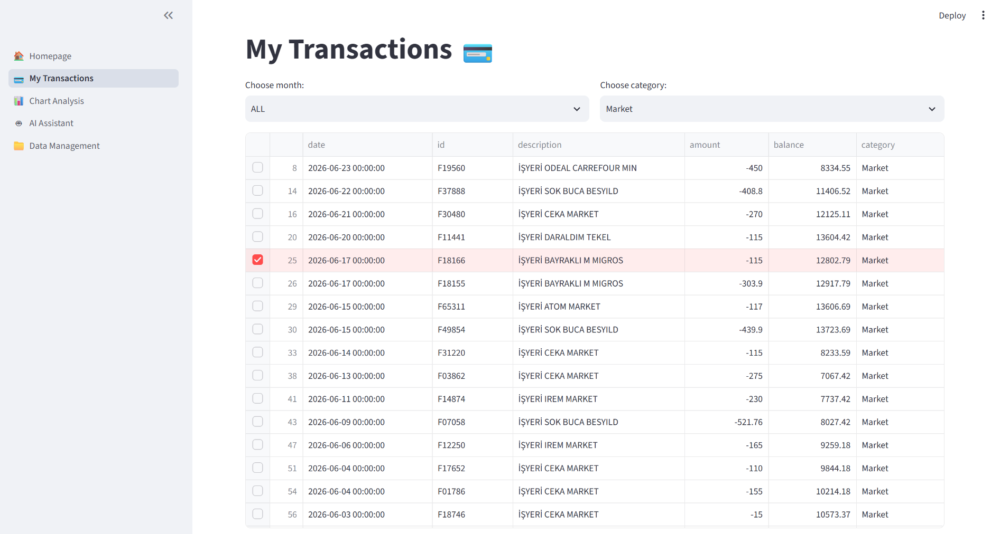
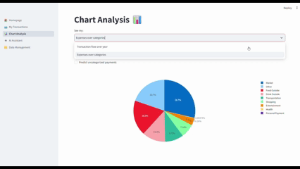
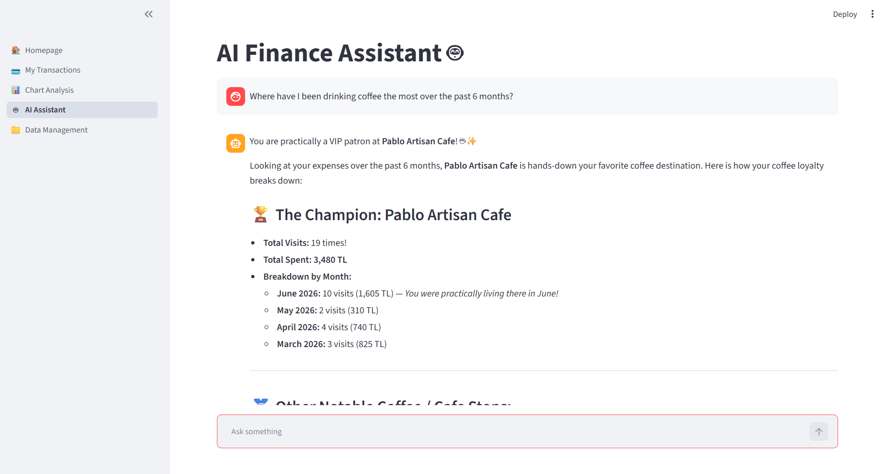
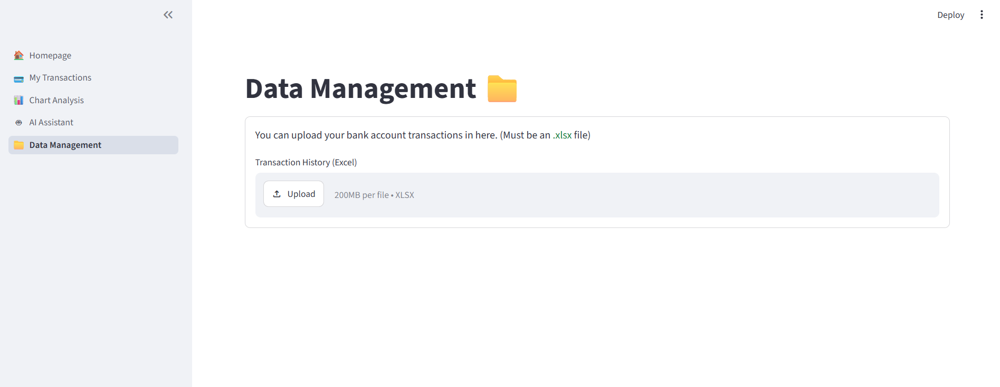

<p align="center">
  
</p>


<h1 align="center">
  FinanceAI
  <span style="font-size: 0.6em; font-weight: normal;">
     — AI-Powered Financial Analysis Platform
  </span>
</h1>

## DEMO


## CONTENTS

1. [About This Project](#about-this-project)
2. [Features](#features)
3. [Tech Stack](#tech-stack)
4. [Project Structure](#project-structure)
5. [Architecture](#architecture)
6. [How It Works](#how-it-works)
7. [Local Installation (without Docker)](#local-installation-without-docker)
8. [Quick Installation with Docker](#quick-installation-with-docker)
9. [Usage](#usage)
10. [User Interface](#user-interface)
11. [Known Limitations](#known-limitations)
12. [Future Improvements](#future-improvements)
13. [Author](#author)

## ABOUT THIS PROJECT
This project began entirely for my own personal interests,
and as it progressed, I kept adding new features with growing enthusiasm until
it finally reached a point where I could present it here. 

Ever since I can remember, I’ve been a bit of a tightwad, 
and as I was thinking, ***“I wish my banking app had a tab that did some
kind of analysis so I could track my spending from there.”***, then it
suddenly occurred to me that I study computer engineering.

I really enjoyed working on this project. Since I started it to meet my own needs,
I believe I designed its features entirely from the user’s perspective,
and I still enjoy using it today.

## FEATURES

- 📈 View the trend of your annual expenses in a single chart.
- 📊 See where you spend the most money based on the automatic categorizations created for you.
- 🎯 Compare your monthly expenses with those of the previous month and see how you're doing.
- 🖥️ Let the app track your spending at unfamiliar locations and predict it for you.
- 🤖 You can consult the Finance Assistant chatbot —customized with your data— on any topic, and request any kind of analysis.


## TECH STACK

| Category              | Technologies       |
|-----------------------|--------------------|
| 🐍 Language           | Python             |
| 🧠 AI                 | Google Gemini API  |
| 🤖 Machine Learning   | scikit-learn       |
| 🎨 UI                 | Streamlit          |
| 📊 Data Processing    | Pandas             |
| 📈 Data Visualization | Plotly             |
| 📦 Database           | SQLite, SQLAlchemy |
| 🔧 Version Control    | Git                |
| 🐋 Containerization   | Docker             |


## PROJECT STRUCTURE

```text
src/
├── application/      # Business logic and application services
├── config/           # Application configuration
├── data/             # Source datasets
├── domain/           # Entities and interfaces
├── infrastructure/
│   ├── data/         # Data ingestion pipeline
│   ├── database/     # SQLite & SQLAlchemy
│   ├── llm/          # Gemini client
│   ├── ml/           # ML classifier
│   └── nlp/          # Text vectorization
└── presentation/
    ├── components/   # Reusable Streamlit components
    └── views/        # Application pages              
```

## ARCHITECTURE

### 🕋 Clean Architecture



## HOW IT WORKS

### Data Pipeline
The data pipeline is responsible for transforming raw bank statements into structured, 
analyzable data. When a user uploads a ``.xlsx`` file, the ``ExcelReader`` and ``DataCleaner`` components
(powered by Pandas) immediately strip away irrelevant header rows, normalize date formats, 
and handle missing values. Once the data is cleaned, it is passed through the ``Categorizer`` class and then the
``ML Categorization model`` to assign appropriate expense tags. Finally, the ``DataBaseMigrator`` securely saves the
processed records into a local ``SQLite`` database using ``SQLAlchemy``, ensuring that all user data 
remains private and local.



### 🤖 AI Assistant Flow
The AI Assistant acts as a bridge between natural language and SQL data, powered by the
``Gemini 3.6 Flash`` model. Instead of relying on static prompts, it uses ``Function Calling``.
When a user asks a question (e.g., "How much did I spend on food last month?"), the AI
decides which internal Python tool to trigger from the ``tools.json`` configuration. 
The backend executes the corresponding query via ``financial_service.py``, retrieves the
exact metrics from the ``SQLite`` database, and feeds the factual data back to Gemini. 
The model then synthesizes this raw data into a clear, conversational Markdown response.



### 📊 Data Visualization & Chart Analysis
The ``📊 Chart Analysis`` module provides interactive financial insights through a clean, 
decoupled architecture. Instead of generating charts directly within the presentation layer, 
the system delegates this responsibility to the ``FinancialVisualizer`` component. When the UI 
requests a specific view, the visualizer leverages ``Pandas`` to aggregate, group, and filter 
the raw SQLite data. It then uses ``Plotly Express`` to render interactive figures (such as
spending trends, category breakdowns) and seamlessly returns them to the frontend. This
modular approach ensures the UI remains lightweight while delivering highly responsive, 
zoomable, and interactive visual data to the user.




### 🕹️ State Management & Dynamic UI

The application utilizes Streamlit's ``st.session_state`` to deliver a highly dynamic
and secure user experience. The interface intelligently adapts to the user's current setup:

- **Empty Database Guard**: Upon launch, the system checks the SQLite repository. If no 
transactions are found, it dynamically restricts the navigation menu using ``st.navigation``,
hiding the AI and Analysis pages and guiding the user directly to the ``📁 Data Management`` tab.


- **Secure API Key Handling**: If the app is **deployed via Docker** or the **.env file is missing**,
the system intercepts the AI initialization. It presents a secure ``st.text_input`` field to collect
the ``Gemini API Key`` on the fly. Using ``st.stop()`` and ``st.rerun()``, the app pauses execution 
until a valid key is provided, instantly unlocking the AI features without ever exposing or
hardcoding credentials.


## LOCAL INSTALLATION (WITHOUT DOCKER)
### 🎟️ Prerequisites
- Python 3.9 or higher
- Git

### Step 1: 👯 Clone the Repository
Open your terminal and run the following commands to clone the project and navigate into the directory:
```bash
git clone https://github.com/iremnaz-d/FinanceAI.git
```
```bash
cd FinanceAI
```

### Step 2: 🏕️ Create and activate a virtual environment (Recommended)
It is highly recommended to use a virtual environment to avoid conflicts with other packages.

#### For Windows
```bash
python -m venv venv
```

```bash
venv\Scripts\activate
```

#### For macOS/Linux
```bash
python3 -m venv venv
```

```bash
source venv/bin/activate
```

### Step 3: ⬆️ Install Dependencies
Install the required Python packages using ``pip``:

```bash
pip install -r requirements.txt
```

### Step 4: 🏃🏻‍♂️ Run the Application 🏃🏼‍♀️‍➡️
Start the Streamlit server by running the main application file:

```bash
streamlit run src/presentation/run_app.py
```


## QUICK INSTALLATION WITH DOCKER

You can use Docker to run the project on your local machine in an isolated
environment without dealing with any Python dependencies.

### Step 1: 👥 Clone the Project
```bash
git clone https://github.com/iremnaz-d/FinanceAI.git
```
```bash
cd FinanceAI
```

### Step 2: 🏗️ Build The Docker Image

Build the application's Docker image by running the following command in the project's 
root directory(where the Dockerfile is located). 
(This process may take 1-2 minutes depending on your computer's speed)
```bash
docker build -t finance_ai .
```

### Step 3: 🏃🏻‍♀️‍➡️ Run App 🏃🏻‍♂️

Use the following command to start the application.

Important Note: When the application runs, the database will be automatically created
under the `src` folder. The `-v` (volume) parameter in the command below ensures that
the database inside Docker is synchronized with your local machine. 
This way, your data will not be lost even if you stop Docker.

#### For Mac/Linux/Git Bash
```bash
docker run -p 8501:8501 -v "$(pwd)/src:/app/src" finance_ai
```

#### For Windows PowerShell
```PowerShell
docker run -p 8501:8501 -v "${PWD}/src:/app/src" finance_ai
```

#### For Windows CMD
```DOS
docker run -p 8501:8501 -v "%cd%/src:/app/src" finance_ai
```

### Step 4: 👀 Access to UI

Once the container is running successfully, 
open your web browser and go to the following address:
```text
http://localhost:8501
```

## USAGE

After installing and launching the application as described in the [Installation](#local-installation-without-docker) section, 
the user interface will guide you through the process so you'll know exactly what to do.

But if you'd still like some suggestions:

### 🗃️ Load & Prepare Your Data (Optional)
The app will open with a **sample dataset already loaded** (I’m sharing all the transactions I’ve made with my Ziraat 
card with you; whoever is reading this, I trust you’re a good person—please don’t let me down 🤝).

If you want to upload your own data (I think only data from Ziraat will work),
make sure the file is in ``.xlsx`` format and **doesn’t contain any formatting**, such as images.
You can upload your file from the ``📁 Data Management`` tab.

### 🔍 Explore the Analysis
- From the ``🏠 Homepage`` tab, you can **select a month** and view that month's summary:

    + 📈 A graphical and percentage-based **comparison of last month** and the month you selected
  
    + ⚽5️⃣ **Top 5 expenses** of that month
  
    + 🧠 You can **view the AI's predictions** for uncategorized expenses for that month:
        * 👩🏻‍🏫 You can **correct predictions** you think are wrong with the correct answers—my ``ML model``
          will be retrained based on your feedback!
        * If you'd like, you can **add a new category** or **delete an existing one**.
      

- In the ``📊 Chart Analysis`` tab, you can see the ups and downs of your annual spending and how much you’ve spent 
in each category; if you’d like, you can have my ML model **predict** the *“Other”* category.


- On the ``💳 My Transactions`` tab, you can view all your transactions, filter them by month and category, 
and delete a transaction if you wish.

### 🤔 Ask Questions

You can go to the ``🤖 AI Assistant`` tab and ask any questions you like. Here are a few questions you can ask:
- Where have I been drinking coffee the most over the past 6 months?


- Final exams ended toward the end of June—can you tell from my spending?


- What do you think were my excessive expenses this past March?


- Why are you so funny? The developer must be a really nice person.


- Could you compare my spending this April with my spending before April? I kind of lost track of things back then...

❗ Since you'll be running the project externally, the system will ask you for your own Gemini API key.
If you don't have one, don't worry—you'll be redirected to a website where you can get one for free!


## USER INTERFACE

> **💡 Note on Dynamic Navigation:** The application features a smart routing system.
> If your database is empty (i.e., you haven't uploaded a transaction file yet), 
> only the **Homepage** and **Data Management** tabs will be visible to smoothly 
> guide you toward setting up your data first.

### 🏠 Homepage
Provides a high-level overview of your financial health with quick summaries
and an intuitive dashboard layout.

<p align="center">
  
</p>

### 💳 My Transactions
Allows you to see and filter your detailed transaction history
extracted directly from your bank statements.

<p align="center">
  
</p>

### 📊 Chart Analysis
Visualizes your income and spending habits over time through 
interactive and easy-to-read charts.

<p align="center">
  
</p>

### 🤖 AI Assistant
Acts as your personal financial advisor, allowing you to ask questions 
about your spending in natural language. 


*(**Note**: When running the app in a ``local environment`` or via ``Docker``, 
this page will securely prompt you to enter your Gemini API Key before
unlocking the chat interface.)*

<p align="center">
  
</p>

### 📁 Data Management
The dedicated space where you can securely upload your bank statement `.xlsx` 
files to initialize or update your local database.

<p align="center">
  
</p>


## KNOWN LIMITATIONS

- **File Type**: Only accepts ``.xlsx`` files as datasets. I didn’t expand this restriction because
I would need a different dataset to do so. Additionally, due to limitations in the `pandas` library, 
the file must not contain any formatting (e.g., images) —it should consist solely of text.


- **Same IDs**: Only when sending money to another person, the data that appears in the bank account is in 
sets of two or three entries (one for the amount sent, the others for the amounts withdrawn to send the money),
all under the same IDs. I had trouble importing all of these account transactions with the same IDs into the
database. Fortunately, this issue doesn’t cause major problems during data analysis.


## FUTURE IMPROVEMENTS
login 
search bar for my transactions descriptions

## AUTHOR

**İrem Naz Durgut**


Computer Engineering Student @ Dokuz Eylül University

- **e-mail**: iremnazdurgut4@gmail.com
- [GitHub](https://github.com/iremnaz-d)
- [LinkedIn](https://www.linkedin.com/in/iremnazdurgut)


